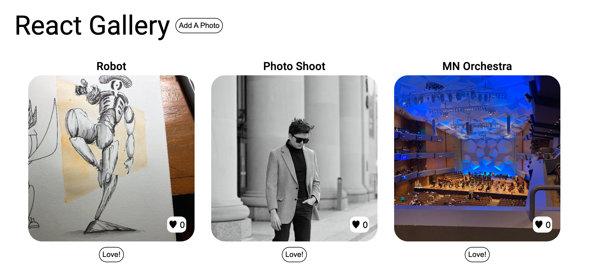

# Weekend-React-Gallery

## Overview

This project is a React gallery application designed for the weekend coding challenge in Week 10 of Prime. It utilizes modern web development tools and libraries to create a dynamic and visually appealing gallery.

## Features

- **Styling:** Uses Emotion for styling, ensuring a responsive and visually pleasing interface.
- **Font:** Integrates Roboto font using `@fontsource/roboto` for a clean and readable look.
- **Material-UI:** Incorporates Material-UI components (`@mui/material`) for a consistent and polished design.
- **HTTP Requests:** Makes asynchronous requests with Axios (`axios`) to fetch data efficiently.
- **Server:** Implements an Express server (`express`) for serving content and handling backend functionalities.
- **File Upload:** Utilizes Multer (`multer`) for handling file uploads.
- **Database:** Connects to PostgreSQL (`pg`) to store and retrieve gallery data.
- **React Ecosystem:** Leverages the latest React (`react` and `react-dom`) and Vite (`vite`) technologies.

## Development

### Prerequisites

- Node.js and npm installed
- PostgreSQL database set up

### Getting Started

1. Install dependencies: `npm install`
2. Start the server and Vite development server: `npm start`
3. Open your browser and navigate to the provided localhost address.
4. Create a PostgreSQL database called `react-gallery`, and paste the data from the `database.sql` file to create the correct table. 
